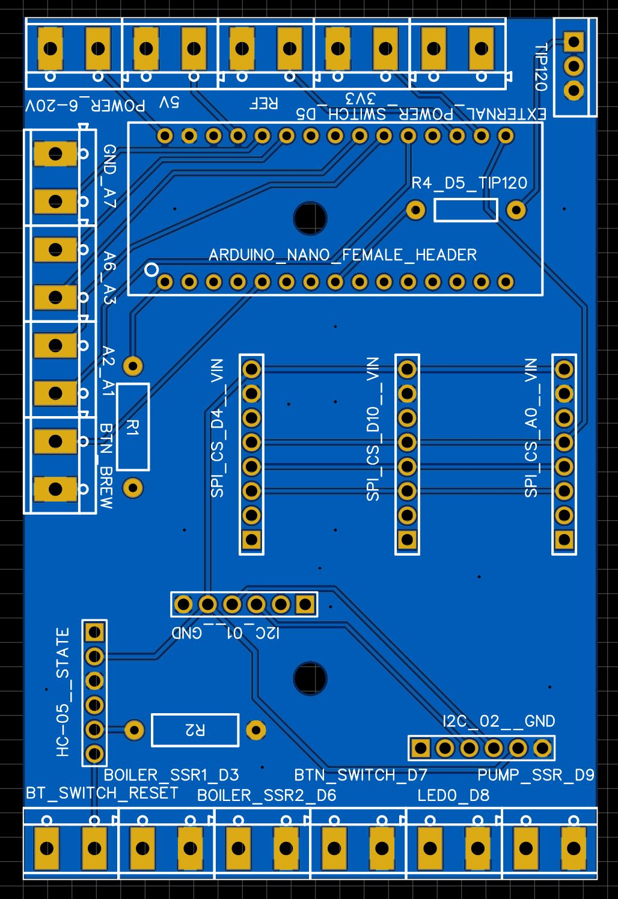
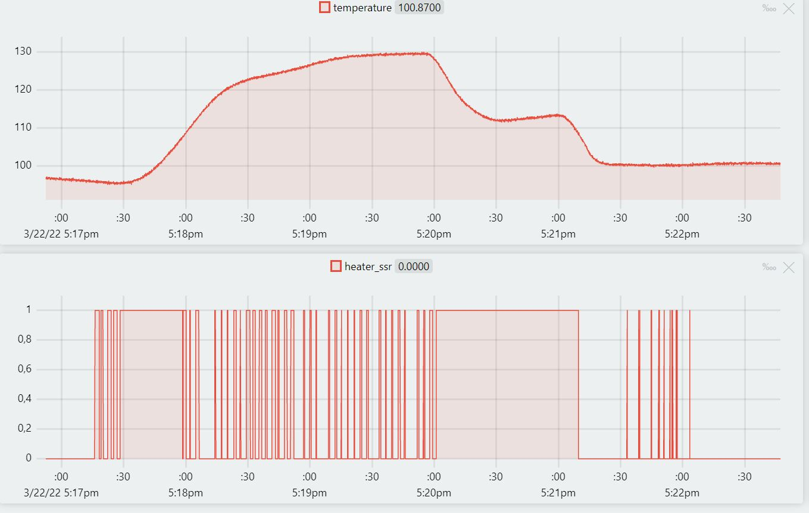

# Single Boiler Espresso Machine
## Disclaimer ##
___
This site, I or the manufacturers of espresso machines shall not be responsible or liable, directly or indirectly, for any damage or loss caused or alleged to be caused by or in  onnection with use of or reliance of this information. No approval has been given by the manufacturer for any modifications. Any modifications done should be carried out by
qualified electrical personnel. 
Applying this mod to your espresso machine or other machine will not only void your warranty but be irreversible where cuts or holes to the casing are made. Also you should know what you are doing when dealing with electricity, water, pressure and heat. This document makes no claim for correctness or completeness.
___

## Overview ##

Here you find a full implementation which runs a single boiler espresso machine such as a Vibiemme Domobar. You can run this code, if your machine has (or will have):
- Single brew/steam boiler
- Single button to operate the machine
- Single LED to show the current machine state
- A lever switch starting the extraction (optional but convenient, present on all E61 groups)
- I use a PT1000 thermocouple on the boiler with MAX31865

This also uses a [PID library](https://github.com/nekowokaburu/StuPID) to get better temperature stability. All I/O can be set in [settings.hpp](VBM/VBM/settings.hpp). There you'll also find some logging macros for debugging purpose which can be turned on or off.

A basic time can be set to turn the machine on and off at a selected time for a set of selectable days.

There is a Android app, which is not part of the project for publishing reasons, currently unpublished in the app store. If you are interested in the bluetooth app with machine settings, please let me know while it is unpublished.

### Machine usage
- Press once to turn the machine on if it is off or toggle the pump on/off if the machine is already on
- Press and hold for at least two seconds toggles brew and steam mode on the boiler
- Press and hold for at least five seconds turns the machine off

#### Machine states (see [VBM::State](VBM/VBM/vbm.hpp)):
-1 Machine has encountered an error and shuts the boiler down
0 Machine is turned off
1 Machine is in optional idle/sleep mode (like keeping a lower temp to preserve energy while enabling a faster heatup to ready)
2 Machine is heating up to brew temperature
3 Machine is att brew temperature
4 Machine is heating up to steam temperature
5 Machine is at steam temperature
6 Machine is cooling down

#### LED feedback
The led has different blink patterns (see [LED::Signal](VBM/VBM/led.hpp)). The most important are:
- LED Off --> The machine is off
- LED solid --> The machine is ready for brewing
- LED blinks very fast --> Machine ready to steam

All other blink states indicate heating to brew, heating to steam, cooling from steam to brew or error state, you will figure that out as you go.

## PCB
The current PCB has support for up to:
- Three thermocouples or other SPI devices
- Two I2C devices, from which I suggest one to be used for a real-time-clock.
- Three SSR outputs (actually more but three are intended for this), also with pwm
- Fixed pwm output to suggestively a TIP120 for higher power devices like a 12 V motor
- All remainng Arduino Nano analog and digital I/O

## PID
Here an example of the hot machine turned on (debugging), heating up to stream temperature. In my case, slow does the trick as an overshoot might trigger the failsave. When opening the steam wand, the temperature starts falling initially, the PID registers the changes and turn the heater 100 % on for the time the steam wand is used. After that I ran water from the tank throught the machine until the boiler was full again and switched back to brew mode. Luckily the boiler temperature was already in the right ballpark, PID kicked in a bit to stabilize and then turned off for the rest of the recording as the temperature is very close to target already.

  

-------------------------------------------------------------------------------------------------
# Untested stuff

## Dual Boiler Espresso Machine
With the current PCB, it should be easily possible to update the code in this repository for use with a dual-boiler espresso machine or other machine types. Even running a roaster or any feedback loop device really. I currently have no dual boiler machine so I won't update for this but let me know how it goes ;)
